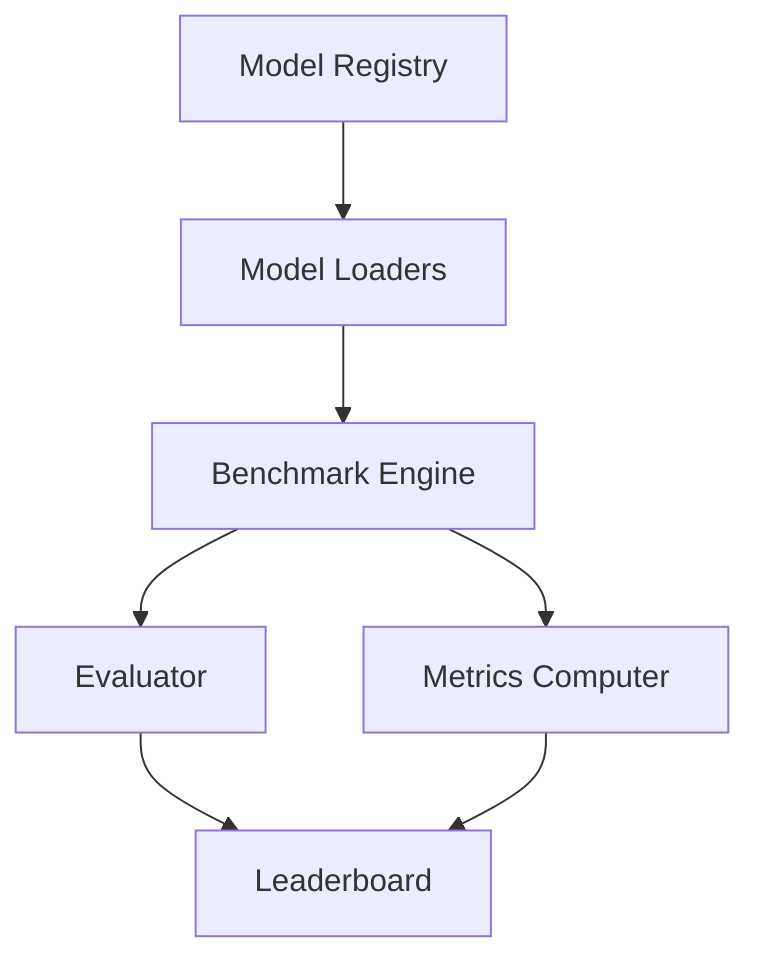

# Video Diffusion Benchmark Suite

Welcome to the comprehensive documentation for the Video Diffusion Benchmark Suite - the first standardized framework for evaluating 300+ video generation models.

## Overview

The Video Diffusion Benchmark Suite provides a unified test-bed for next-generation open-source video diffusion models (VDMs). With the rapid growth in VDM research, this suite addresses the critical need for standardized evaluation across latency, quality, and VRAM trade-offs.

## Key Features

- **🐳 Dockerized loaders** for all major VDMs (SVD++-XL, Pika-Lumiere, DreamVideo-v3)
- **📊 Unified metrics** including clip-level FVD, temporal consistency, and motion quality
- **🏆 Live leaderboard** with nightly CI updates tracking the Pareto frontier
- **⚡ Hardware profiling** for realistic deployment planning
- **🔬 Reproducible benchmarks** with fixed seeds and standardized prompts

## Quick Start

```python
from vid_diffusion_bench import BenchmarkSuite, StandardPrompts

# Initialize suite
suite = BenchmarkSuite()

# Run evaluation
results = suite.evaluate_model(
    model_name="svd-xt-1.1",
    prompts=StandardPrompts.DIVERSE_SET_V2,
    num_frames=25,
    fps=7
)

print(f"FVD Score: {results.fvd:.2f}")
```

## Architecture



## Getting Started

Ready to benchmark your video diffusion models? Check out our guides:

- **[Installation](getting-started/installation.md)** - Set up the benchmark suite
- **[Quick Start](getting-started/quickstart.md)** - Run your first benchmark
- **[Docker Setup](getting-started/docker.md)** - Use containerized models

## Community

- **GitHub**: [Report issues and contribute](https://github.com/yourusername/vid-diffusion-benchmark-suite)
- **Discord**: [Join our community](https://discord.gg/vid-diffusion)
- **Live Dashboard**: [View current leaderboard](https://vid-diffusion-bench.streamlit.app)

## Citation

```bibtex
@software{vid_diffusion_benchmark_suite,
  title={Video Diffusion Benchmark Suite: Standardized Evaluation for 300+ Models},
  author={Daniel Schmidt},
  year={2025},
  url={https://github.com/yourusername/vid-diffusion-benchmark-suite}
}
```